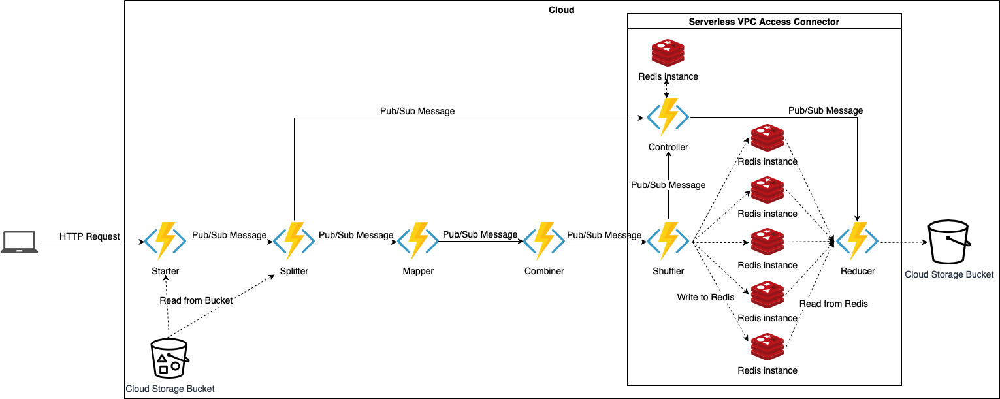

# Serverless MapReduce to find Anagrams in a dataset

### Contents

- [Introduction](#introduction)
- [Prerequisites](#prerequisites)
- [Deployment](#deployment)
- [Running the Anagram MapReduce](#running-the-anagram-mapreduce)
  - [Option 1](#option-1)
  - [Option 2](#option-2)
  - [Results](#results)
- [Tests](#tests)
- [22COC105 Output](#22coc105-output)

### Introduction

This project is a Serverless MapReduce implementation to find anagrams in a set of Project Gutenberg books in the format
of text files. The project is written in Go and uses GCP Cloud Functions, Cloud Pub/Sub, Cloud Storage and Cloud Memorystore 
for Redis. I chose to write the project in Go as it is a language that is very fast, and easy to write concurrent code 
in, thus allowing the MapReduce process to run at high speed. The project was written for the 22COC105 Cloud Computing 
coursework.

The project is split into 2 main parts as the MapReduce programming model follows. The first is the map phase, in which the
data is split, preprocessed, mapped to a key-value pair and combined at a per book level (mini-reduce). The second is the 
reduce phase, in which the key-value pairs are shuffled into redis instances based on a hash of the key, and then reduced
together to find the anagrams.

The whole process takes under 20 seconds to run on 100 books, which is equivalent to ~43MB of data.

### Prerequisites

- In order to deploy any part of the project, you need to have gcloud CLI installed and configured. You can find the 
instructions [here](https://cloud.google.com/sdk/docs/quickstarts).
- You need to have a GCP project with billing enabled. You can find the instructions 
[here](https://cloud.google.com/billing/docs/how-to/modify-project).
- In order to run the tests, you need to have Go version 1.16 installed. You can find the instructions
[here](https://golang.org/doc/install). You will also need to have Docker installed. You can find the instructions
[here](https://docs.docker.com/get-docker/).
- Run `chmod +x ./*/*.sh` in the project root to make the scripts executable.

### Deployment

The first step is to create a `.env` file and set the `GCP_PROJECT` variable to the name of the GCP project you wish to deploy 
everything to, the `GCP_REGION` variable to the region you wish to deploy to (you can find the list of available regions
[here](https://cloud.google.com/compute/docs/regions-zones)), and the `NO_OF_REDUCERS` variable to the number of reducer 
jobs you want to run (I used 5). An example file `.env.example` is provided in the root of the project. You can copy it 
to `.env` and modify it to your needs using `cp .env.example .env`.

You should then create two buckets in GCP Cloud Storage, one for the input data and one for the output data. You can 
either do this using the GCP console or by using the following commands:

```bash
gsutil mb -p $GCP_PROJECT -l $GCP_REGION gs://$GCP_PROJECT-input
gsutil mb -p $GCP_PROJECT -l $GCP_REGION gs://$GCP_PROJECT-output
```

These bucket names should then be used when starting the MapReduce process. See [running the Anagram MapReduce](#running-the-anagram-mapreduce)
for more details.

Deploying the functions and Redis instances is extremely easy due to the Bash scripts provided in each directory. To run 
these scripts, Make commands are provided. You can find the Makefile in the root directory of the project. The commands 
are:

**Note:** The commands are run from the root directory of the project.

**Note:** When you receive the following message: `Allow unauthenticated invocations of new function [starter]? (y/N)` Choose `y`

```bash
# Deploy all the functions and Redis instances
make deploy

# OR individually

# Deploy the Redis instances
make deploy-redis
# Deploy the controller function
make deploy-controller
# Deploy the starter function
make deploy-starter
# Deploy the splitter function
make deploy-splitter
# Deploy the mapper function
make deploy-mapper
# Deploy the combiner function
make deploy-combiner
# Deploy the shuffler function
make deploy-shuffler
# Deploy the reducer function
make deploy-reducer
```

Once deployed, you should find the following resources in your GCP project:
- Cloud Functions
  - `controller`
  - `starter`
  - `splitter`
  - `mapper`
  - `combiner`
  - `shuffler`
  - `reducer`
- Cloud Pub/Sub Topics
  - `mapreduce-controller`
  - `mapreduce-splitter`
  - `mapreduce-mapper`
  - `mapreduce-combiner`
  - `mapreduce-shuffler`
  - `mapreduce-reducer`
- Cloud Memorystore for Redis
  - N instances, where N is the number of reducers you specified in the `.env` file
- Serverless VPC Access connector
  - `mapreduce-connector`

Here is a diagram of how the architecture is linked using 5 redis instances and thus 5 reduce jobs:



Similarly, you can delete the functions and Redis instances using the following commands:

```bash
# Delete all the functions and redis instances
make remove

# OR individually

# Delete the Redis instances
make remove-redis
# Delete the controller function
make remove-controller
# Delete the starter function
make remove-starter
# Delete the splitter function
make remove-splitter
# Delete the mapper function
make remove-mapper
# Delete the combiner function
make remove-combiner
# Delete the shuffler function
make remove-shuffler
# Delete the reducer function
make remove-reducer
```

**Note:** The deployment scripts are written in Bash and were tested on Linux and macOS. They may not work on Windows.

**Warning:** The deployment scripts create several services in GCP that you will be charged monthly for - namely Redis 
instances and a serverless VPC connector. Make sure you delete these after you are done running the project.

### Running the Anagram Mapreduce

To start the MapReduce running on a dataset, you need to ensure that the data is in a Google Cloud Storage bucket. 

There are two ways of starting the MapReduce:

#### Option 1
Using the Make command which will run the script `./scripts/start-anagram-mapreduce.sh` that asks you to provide the
names of the input and output buckets. This is the easiest way to start the MapReduce.
```bash
make start
```
#### Option 2
Find out the uri you need to call the starter function with using the command (replace $GCP_REGION and $GCP_PROJECT with
the region and project you deployed to):
```bash
gcloud functions describe starter --region=$GCP_REGION --project=$GCP_PROJECT --format="value(serviceConfig.uri)"
```
Then, you can call the starter function using the following command (replace $URI, $INPUT_BUCKET and $OUTPUT_BUCKET with the
values you know):
```bash
curl -X GET "$URI?input_bucket=$INPUT_BUCKET&output_bucket=$OUTPUT_BUCKET" | jq
```

#### Results
Upon the successful starting of the MapReduce, you will receive a similar response:
```json
{
  "responseCode": 200,
  "message": "MapReduce started successfully - results will be stored in: serverless-mapreduce-output"
}
```
In order to check whether the mapreduce has finished, you can use the following command (where $OUTPUT_BUCKET is the name of
the bucket you provided as the output bucket):
```bash
gsutil ls gs://$OUTPUT_BUCKET | grep -E "anagrams-part-[0-9]+.txt"
```
If you deployed the project with 5 reducer jobs, you should see 5 files in the output bucket. In this case, if you see 
less than 5 files, it means that the reduce phase is still running.

To retrieve the files, you can use the following command (where $OUTPUT_BUCKET is the name of the bucket you provided as the
output bucket):
```bash
gsutil -m cp -R gs://$OUTPUT_BUCKET .
```

In each file, each line is in the format of `sorted_word: word1 word2 word3 ... wordN`, where {word1, word2, word3, ..., 
wordN} is a set of sorted anagrams. For example a line could be:`aet: ate eat tea`.

### Tests

Unit tests exist that allow you to test the full functionality of each cloud function. All of these tests, including the 
creation and removal of the Docker containers used in them, can be run using the command:
```bash
make test
```

**Note:** Sometimes the splitter tests can fail due to the fact that the storage emulator is not ready when the tests are, 
and the tests fail. If this happens, just remove the containers using `make teardown-test` and run the tests again.

For more information on the tests, see below

Before running any tests, you will need to run several Docker images that mock GCP cloud services used in the project.
This includes an official image by Google `gcr.io/google.com/cloudsdktool/cloud-sdk:latest` which I use to mock the 
PubSub service, and an open-source image `oittaa/gcp-storage-emulator` found 
[here](https://hub.docker.com/r/oittaa/gcp-storage-emulator) to mock Storage Buckets. I also use the official Redis 
image `redis-stack:latest` to create a local Redis instance running in a Docker container.

If you have Docker installed, you can run the following command to create the containers:

```bash
make setup-test
```

Or alternatively, you can run a subset of the containers by running any of the following commands:

```bash
make create-pubsub-emulator 
make create-storage-emulator 
make create-local-redis
```

To remove the containers, you can run the following command:

```bash
make teardown-test
```

Or alternatively, you can remove a subset of the containers by running any of the following commands:

```bash
make remove-pubsub-emulator 
make remove-storage-emulator 
make remove-local-redis
```

Unit tests exist for all the functions written in the project that mock the actual functionality of there use in GCP. 
I used these throughout the development of the MapReduce in order to ensure that no changes I made to my code caused 
anything to break. To run these unit tests, one 
can run the command:
```bash
make test-unit
```

A script also exists that allows for checking of the test coverage of each package (note that you will need a newer 
version of bash that allows `declare -A`, I installed it using Homebrew). This can be run using the command:
```bash
make test-coverage
```

### 22COC105 Output

A bucket exists in GCP that contains the output files containing all the anagrams from the 100 books as required by the 
22COC105 coursework. The bucket is accessible from the internet read-only. Therefore, in order to download these files, 
one can run the command:

```bash
gsutil -m cp -R gs://serverless-mapreduce-output/ .
```